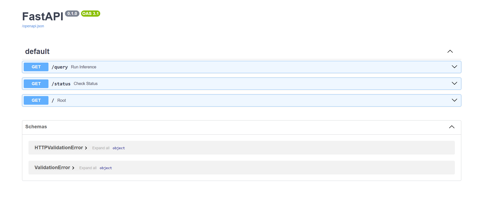
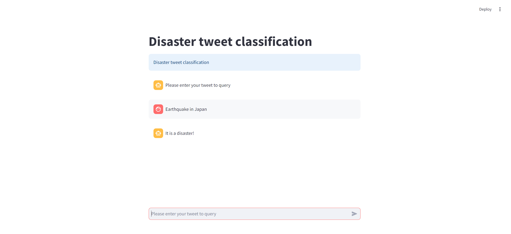

Last updated: August 2024

# End-to-end example with the Disater Tweet dataset

**Keywords**: FastAPI, Streamlit, deployment, end-to-end (e2e), NLP, text preprocessing, NLTK, TfidfVectorizer

We provide an end-to-end example with the 'Disaster Tweet Classification' example, which classifies a tweet (text string) into whether it is a disaster or not. Previously, we performed an exploratory data analysis and ran model architecture and hyperparameter searches in a separate repo.

In this repo, we implement a) a training pipeline, b) an inference FastAPI backend, and c) an example Streamlit app to query the FastAPI backend.

1. A training pipeline in `./training_pipeline`
    - Notably we use TfidfVectorizer and logistic regression, which constitute a computationally efficient solution
    - Folder structure:
      - `data`: training dataset: ideally it is downloaded from blob storage
      - `data_train`: transformed training data
      - `src`: Python code for the training pipeline
      - `run_train_pipeline.py`: training pipeline entrypoint
      - `train_config.yml`: training pipeline config
      - `model_assets`: the fitted objects/model together with evaluation scores are saved to this folder, which in a realife scenario they will be uploaded to blob storage
      - `requirements.txt`
    - To run the training pipeline:
       1. Navigate to `./training_pipeline` folder
       2. Supply training dataset, containing `train.csv`
       3. Run `pip install -r requirements.txt`
       4. Set `train_config.yml`
       5. Run `python3 run_train_pipeline.py -c train_config.yml`
2. A corresponding inference FastAPI backend in `./inference_backend`
   - Folder structure:
     - `model_assets`: contains the fitted objects/model from running the training pipeline; in a realife scenario they will be downloaded from blob storage
     - `src`: Python code for the inference pipeline corresponding to the training pipeline using the fitted `model_assets`
     - `main.py`: FastAPI app
     - `Dockerfile` and `docker_compose.yml`: used to build and start a container
   - To test the backend:
     1. Navigate to `./inference_backend` folder
     2. Supply `./model_assets` by running the training pipeline
     3. Run `docker build . -t disaster/inference_backend:dev` to build the Docker image locally
     4. Run `docker compose -f "inference_backend/docker_compose.yml" up -d --build` to spin up the container
     5. Test the endpoint using Swagger UI at `http://localhost:3100/docs`
     6. To kill the container, run: `docker compose -f "inference_backend/docker_compose.yml" down`

3. An example Streamlit app to query the FastAPI backend in `./streamlit`
   - Folder structure:
     - `app_config.yml`: specifies `endpoint_base` of the backend
     - `app.py`: streamlit app
     - `backend_client.py`: Client that connects to the FastAPI backend
     - `requirements.txt`
   - To test the Streamlit app:
     1. Start the backend container (last section)
     2. Navigate to `./streamlit` folder
     3. Run `pip install -r requirements.txt`
     4. Run `streamlit run app.py`
     5. Go to `http://localhost:8501` on a browser to start querying

